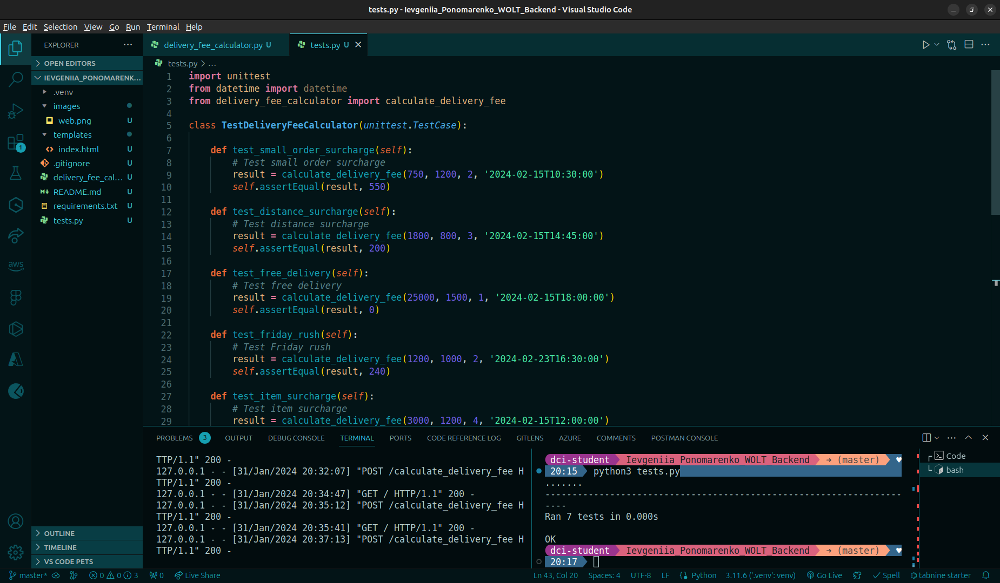
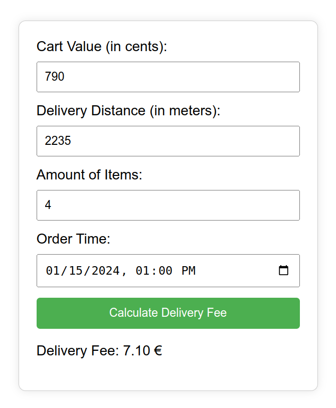

# [WOLT Delivery Fee Calculator ](https://github.com/woltapp/engineering-internship-2024/blob/main/README.md)

This project implements an HTTP API for calculating the delivery fee based on the provided specifications. The API exposes a single POST endpoint that accepts a JSON payload with information about the shopping cart and order details and responds with the calculated delivery fee.

**Project Overview**

This project includes the following files:

* `delivery_fee_calculator.py`: Flask application for calculating the delivery fee.
* `tests.py`: This file contains tests for calculating all scenarios.
* `requirements.txt`: This file contains requirements
* `templates/index.html`: HTML template for the simple web interface to test calculator.
* `README.md`: This file contains the documentation for the calculator

**Prerequisites**

To run this project, you need:

* Python 3.x
* pip (Python package installer)

**Setup**

1. Install Python and pip if you haven't already.
2. Create a virtual environment using the command `python3 -m venv .venv`.
3. Activate the virtual environment:
    * On Windows: `.venv\Scripts\activate`
    * On Unix or macOS: `source .venv/bin/activate`
4. Install dependencies using the command `pip install -r requirements.txt`.

**API Usage**

1. Make sure that Flask application is running `python3 delivery_fee_calculator.py` on http://127.0.0.1:5000/calculate_delivery_fee/ before executing `tests.py`. 
2. Open another terminal window to execute and to run `python3 tests.py`.


**Flask web interface: simple frontend for testing all scenarios.**

1. Start the Flask application by running the command `python3 delivery_fee_calculator.py`.
2. Open your web browser and navigate to http://127.0.0.1:5000/ to access the web interface.
3. On the web interface you can select the cart value, delivery distance, amount of items and time of order.
4. Click the "Calculate Delivery Fee" button.


Endpoint: `POST /calculate_delivery_fee`

Request Payload:

```json
{
  "cart_value": 790, // Value of the shopping cart in cents.
  "delivery_distance": 2235, // Distance between the store and customer's location in meters.
  "number_of_items": 4, // Number of items in the customer's shopping cart.
  "time": "2024-01-15T13:00:00Z" // Order time in UTC in ISO format.
}
```
### Output examples in terminal:

**Tests scenario**




### Output examples in web browser:




**Feel free to connect with Me 😊 👋**

[](https://www.linkedin.com/in/ievgeniia-ponomarenko-python/)


[](https://github.com/Lightmaker777)
